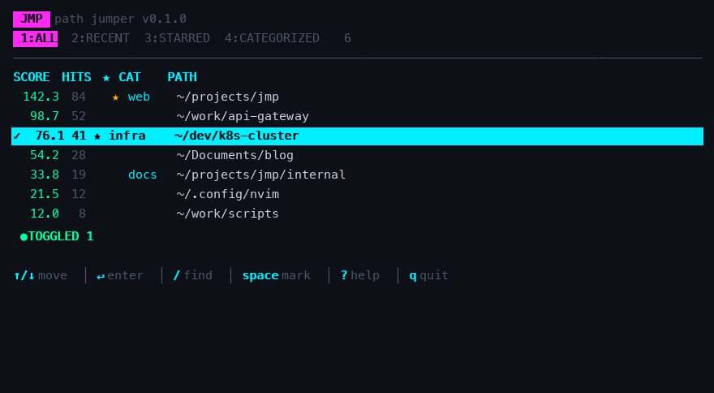

# jmp

[English](README.md) | [简体中文](README.zh-CN.md)

**jmp** is a smart directory jumper — a Go rewrite and enhancement of
[autojump](https://github.com/wting/autojump). It learns the directories you
`cd` into and lets you jump back to them with a few keystrokes.

Ranking uses a **frecency** algorithm (frequency + time decay), with substring
matching preferred over fuzzy matching. It is cross-platform:
macOS / Linux / WSL / Windows.

---

## Features

- 🚀 **One-key jump** — `j foo` jumps to the most-used directory matching `foo`.
- 🧠 **Frecency ranking** — combines visit frequency with a 7-day half-life
  recency decay, so recently and frequently used dirs win.
- 🔍 **Substring + fuzzy matching** — exact substring hits always rank above
  fuzzy matches; multi-keyword queries narrow results.
- 🏷️ **Aliases** — `jmp alias set proj /code/project`, then `j @proj`.
- 🖥️ **TUI manager** — interactive viewer (Bubble Tea) to search, star,
  categorize, edit weights, and delete entries.
- 🐚 **Shell integration** — bash, zsh, fish, and PowerShell, with tab
  completion and `back` / `fwd` / `-` navigation history.
- 🔄 **Multi-device sync** — sync the database across machines over SSH/SCP
  (pull → merge → push), with a configurable interval.
- 📥 **Import** — ingest paths from a text file or common history files.
- 🧰 **Maintenance** — `doctor`, `clean`, `stats`, JSON output, and more.

<!-- TUI screenshot placeholder. Drop your screenshot at docs/images/tui-main.png
     (run `jmp tui` in an 80x24+ terminal, then screenshot). Until the image
     exists, GitHub renders the broken-image icon; once added it shows inline. -->
<p align="center">
  
</p>

## Installation

```bash
# Option 1: go install (needs Go 1.21+)
go install github.com/bytenote/jmp@latest

# Option 2: build from source
make build
make install   # installs to /usr/local/bin/jmp

# Option 3: download a prebuilt binary from Releases
# https://github.com/biyan113/jmp/releases
```

Requires Go 1.21+ (uses the builtin `min`/`max`).

## Shell Integration

Add the matching line to your shell config, then restart the shell. After that
the `j` command is available.

```bash
# bash  (~/.bashrc)
eval "$(jmp init bash)"

# zsh   (~/.zshrc)
eval "$(jmp init zsh)"

# fish  (~/.config/fish/config.fish)
jmp init fish | source

# PowerShell  ($PROFILE)
Invoke-Expression (& jmp init powershell | Out-String)
```

The integration auto-records every directory you enter and runs background sync
(if configured).

## Usage

### Jumping

```bash
j foo          # jump to the best match for "foo"
j foo bar      # multiple keywords (all must match)
j @proj        # jump via alias
j              # open the TUI manager
j -            # previous directory
j back         # jump back   (requires JMP_BACK, set by integration)
j fwd          # jump forward (requires JMP_FWD)
j /etc         # absolute path
j ~/Documents  # home-relative path
j src          # relative subdir (when there's no DB match)
```

**`j` also acts like `cd`**: it first queries the jmp database; on a miss it
falls back to treating the arguments as a directory path (supports `~`,
absolute paths, and relative names). So `j src` jumps to a known project when
one exists, otherwise it enters the `src` subdir. Any directory you `cd` into
this way is recorded by the shell hook, so it becomes a future `j` target.

### Path management

```bash
jmp add /path/to/dir          # add a path manually
jmp add /path/to/dir -w 10    # with an initial weight
jmp remove /path/to/dir       # remove a record (aliases: rm, del)
jmp list                      # list all entries
jmp list -n 20                # limit to 20
jmp list -q keyword           # filter by keyword
```

### Aliases

```bash
jmp alias                     # list all aliases
jmp alias set proj /path      # create an alias
jmp alias remove proj         # remove an alias (aliases: rm, del)
j @proj                       # jump using the alias
```

### TUI manager

```bash
jmp tui       # open the interactive manager
jmp --tui     # same as above
```

Key bindings: `↑/↓` move · `enter` jump · `/` search · `space` mark ·
`s` star · `c` category · `e` edit weight · `d` delete · `a` add ·
`1/2/3/4` filter (all/recent/starred/categorized) · `i` detail ·
`p` preview · `?` help · `q` quit.

### Maintenance

```bash
jmp stats                     # database statistics
jmp doctor                    # health check (missing paths, broken aliases)
jmp clean                     # remove missing paths and broken aliases
jmp clean --dry-run           # preview what would be removed
```

### Import

```bash
jmp import ~/path_history.txt   # import paths from a text/history file
```

### Multi-device sync

Sync the database over SSH/SCP. Merge strategy: **weight = max, visits = max,
last-visit = latest**. Once configured, the shell hook syncs in the background
(subject to the interval).

```bash
jmp sync set user@host:~/.local/share/jmp/db.json        # configure remote
jmp sync set user@host:~/.local/share/jmp/db.json 600    # with interval (seconds)
jmp sync                # sync now (pull + merge + push)
jmp sync push           # push only
jmp sync pull           # pull and merge only
jmp sync auto           # sync only if interval elapsed (called by shell hook)
jmp sync status         # show config and last sync time
```

> Requires passwordless SSH/SCP access (e.g. key-based auth) to the remote host.

### Configuration

```bash
jmp config                                  # show current config
jmp config color <auto|always|never|ansi256|truecolor>   # set TUI color mode
```

### Global options

| Option | Description |
|--------|-------------|
| `--db <path>` | Use a custom database file path |
| `--json`     | Output in JSON |

```bash
jmp version    # print the build version
```

## Development

```bash
make build      # build the local binary
make test       # run tests
make lint       # go vet
make build-all  # cross-compile all platforms into dist/
make clean      # remove build artifacts
```

## How Ranking Works

Each entry has a frecency score:

```
frecency = weight × 0.5 ^ (hours_since_last_visit / 168)
```

A 7-day half-life means a dir visited a week ago is worth half as much as one
visited now. When the total weight across all entries exceeds 9000, every
weight is scaled by 0.9 (autojump-style aging) to prevent unbounded growth.

On top of frecency, `matcher.Rank` applies bonuses/penalties: last path
component exact match (×3), prefix match (×1.5), starred (×1.25), alias match
(×2), current-directory proximity (×1.2), and non-existent path (×0.1).
Substring matches always outrank fuzzy matches.

## License

MIT
